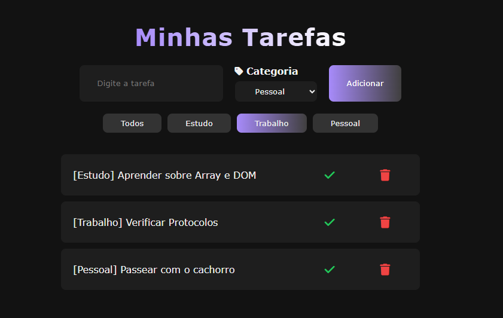

# 📝 Minhas Tarefas - JS

Um pequeno projeto de lista de tarefas criado com **HTML**, **CSS** e **JavaScript**, com o objetivo de praticar e reforçar conhecimentos em **Desenvolvimento Web**.

## 🚀 Funcionalidades

- Adicionar tarefas com título e categoria
- Excluir tarefas individualmente
- Layout responsivo e visual agradável
- Estilo personalizado com cores acessíveis
- Interface funcional para uso pessoal

## 📌 Tecnologias Utilizadas

- HTML5
- CSS3
- JavaScript Puro

## 💡 Objetivo

Esse projeto foi desenvolvido como forma de estudo e aprimoramento das habilidades em JavaScript e manipulação do DOM, além de praticar boas práticas com Git e GitHub.

## 🛠️ Melhorias Futuras

- Armazenamento local com **LocalStorage** (para manter as tarefas ao recarregar)
- Migração para **React**
- Marcar tarefas como concluídas
- Filtro por categoria ou status

---

📅 Projeto criado e mantido por **Luigi Henry** — [@luighenrydev](https://github.com/luighenrydev)